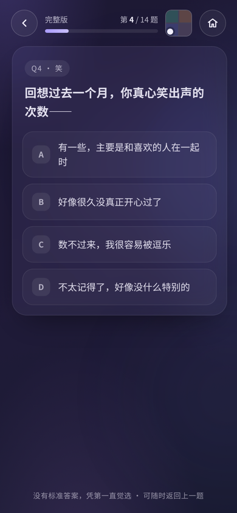
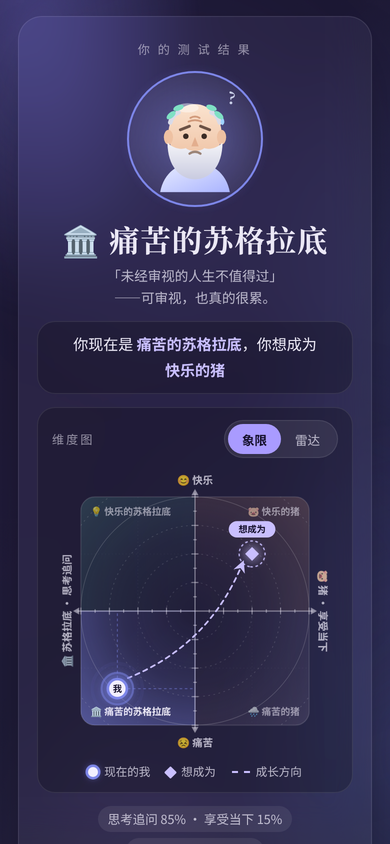
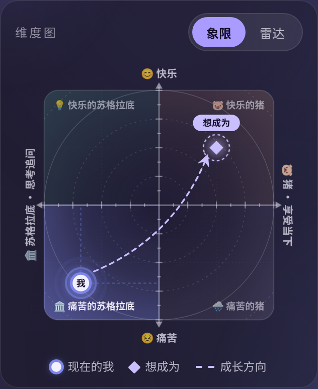
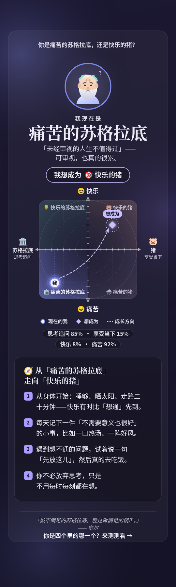

# 你是痛苦的苏格拉底，还是快乐的猪？

> 「做一个不满足的人，胜过做一只满足的猪；做一个不满足的苏格拉底，胜过做一个满足的傻瓜。」
> —— 约翰·斯图尔特·密尔《功利主义》，1863

一个移动端 H5 小测验：用两个维度把人放进四个象限——**你习惯思考追问，还是享受当下？你此刻真实的感受，是痛苦还是快乐？**
测完告诉你「你现在是谁」「你想成为谁」，并给出几条温和、具体的建议，帮你更接近自己想要的样子。

- 🌐 在线体验：<https://socrates-pig.000555.best>
- 💻 源码仓库：<https://github.com/GinWU05/socrates-pig>
- 📦 源码分在 `src/`，构建后产出单个自包含的 `dist/index.html`（CSS / JS / SVG 全部内联）：**运行时零依赖、不加载任何 CDN 或外部资源、可离线打开**。开发时只用到 `playwright-core`（跑测试）和 `qrcode`（构建时生成结果图里的二维码矩阵）

<p align="center">
  
  
  
</p>

## 功能

- **完整版（14 题）**：13 道计分题，同时在两个维度上计分（每个选项可影响一个或两个维度）；第 14 题不计分——「如果可以选，你想成为这四个里的哪一个？」
- **速通版（2 题）**：直接自选「我现在是哪一个」「我想成为哪一个」，结果页标注「速通版·自评」，并可一键「做完整版」
- **四象限结果**：痛苦的苏格拉底 / 快乐的苏格拉底 / 痛苦的猪 / 快乐的猪，结果页显示「你现在是 X，你想成为 Y」
- **维度图**：自绘 SVG 象限图（渐变象限、同心网格、刻度、呼吸光点、从「现在」指向「想成为」的虚线弧箭头、图例），可切换 4 轴雷达图（思考 / 享受 / 痛苦 / 快乐）；完整版答题时，顶栏的迷你象限会实时显示当前位置
- **成长建议**：16 组内容——12 种 X → Y 的转变路径 + 4 种「保持现状」的健康建议，每组 3–4 条
- **结果图分享**：canvas 绘制 1080 宽高清长图（含象限图、现在/想成为、建议；完整版另含两轴得分）。点「生成结果图」总是先打开预览弹窗，弹窗里的图片一律是 dataURL 的 ``，任何浏览器都能长按保存。弹窗文案只有一行提示「长按保存图片」（桌面不显示），不弹 toast、不闪烁，也不会盖住按钮。「分享」按钮一律按功能检测显示：打开弹窗时先生成 PNG File，`navigator.canShare({files:[file]})` 为真就显示「分享」并调用 `navigator.share`（微信、安卓里也一样），否则隐藏。share 被拒（用户取消或其它错误）都不弹提示。UA 只用来决定有没有「保存图片」按钮：
  - **微信等 App 内置浏览器和所有安卓浏览器**（UA 含 MicroMessenger、QQ、微博、钉钉、飞书、Facebook、Instagram、Android 等，或 iOS 上不是 Safari 的 WebView）：没有「保存图片」按钮（微信里下载只会变成「文件」，安卓下载会进「下载」而不是相册），不用 a[download] 或 blob: 地址；只有「分享」（支持时）和提示「长按保存图片」。这时的预览图是 JPEG dataURL（质量 0.88，超过 800 KB 会依次缩到 900 / 750 宽），图片设为 `draggable=false`、`-webkit-user-drag:none`、`-webkit-touch-callout:default`；图片和外层容器都不加 transform / filter / 动画 / backdrop-filter，预览区里的触摸事件也不调用 `preventDefault`，免得 iPhone 微信长按变成拖动图片、不弹保存菜单
  - **iOS Safari / iOS Chrome**：从不走下载。支持文件分享时，「保存图片」和「分享」都会调起系统分享面板（可选「存储图像」）；不支持时两个按钮都隐藏，只提示「长按保存图片」
  - **桌面浏览器**：「保存图片」用 `a[download]` 直接下载 PNG
  - 系统分享在点击里同步调用 `navigator.share`（PNG 和 File 打开弹窗前就已生成），满足 iOS Safari 的用户手势要求。结果图上下各留一段背景（上 ≈ 0.174×宽、下 ≈ 0.256×宽），在刘海 / 灵动岛 iPhone 上全屏查看时，内容不会被状态栏和 Home 指示条挡住
- **禁止选字**：全站 `user-select:none`（含长按选字），只有 input / textarea / contenteditable 保持可选可输入；不在全局关闭长按菜单，结果预览图单独设为 `-webkit-touch-callout:default` 和 `-webkit-user-select:auto`，长按仍能弹出「保存图片」
- **结果图二维码**：结果图底部「来测测看」旁有一个指向 <https://socrates-pig.000555.best> 的二维码（版本 3、纠错等级 M、29×29 模块、每模块 8px、四周 4 模块白色静区，纯黑配纯白），可在微信里长按识别。矩阵在构建时由 `qrcode` 生成并内联进页面，运行时不依赖任何库
- **构建版本**：封面和结果页最底部有一行很淡的 `build <提交短哈希>`，由 `build.js` 在构建时通过 `git rev-parse --short HEAD` 自动写入（不在 git 仓库时用环境变量 `SP_COMMIT`，再没有就显示 `dev`）。如果构建产物 `dist/` 在源码提交之后单独提交，页面上显示的是源码那次提交的哈希
- **返回导航**：答题页左上角的返回箭头回到上一题，第 1 题时回到封面；右上角的房子图标（「回到首页」），已有答题进度时先确认「退出后本次答题进度会丢失」；结果页底部有「回到首页」。浏览器历史按「封面 → 答题/结果 → 结果图弹窗」三层记录（`history.pushState` / `popstate`），所以手机返回手势和浏览器后退会：先关掉结果图弹窗；答题中有进度时弹出退出确认（再按一次返回 = 取消）；没有进度或在结果页时回到封面。返回手势不会逐题后退
- **固定配色**：唯一皮肤「深夜」靛紫；不跟随系统深浅色，阻止 Android Chrome 自动深色与 Dark Reader 等扩展改色（`color-scheme: only light`、`supported-color-schemes`、`darkreader-lock`）
- **禁止缩放**：`maximum-scale=1, user-scalable=no`、`touch-action: manipulation`，并拦截 iOS 双指缩放 / 双击放大
- **GitHub 角标**：封面和结果页右上角有一个低调的主题色章鱼猫角标（悬停或点按时挥手），新标签页打开源码仓库；答题页、结果图弹窗和退出确认框打开时自动隐藏，也不会画进结果图
- **体验细节**：流畅动画且尊重 `prefers-reduced-motion`；适配刘海 / 底部安全区；无横向滚动；按钮有键盘焦点样式和 ARIA 标签

<p align="center">
  
  
  
</p>

## 计分方式

| 维度 | 正方向（+1） | 负方向（−1） |
| --- | --- | --- |
| A 轴：怎么活 | 🏛️ 苏格拉底 · 思考追问 | 🐷 猪 · 享受当下 |
| B 轴：感受如何 | 😊 快乐 | 😣 痛苦 |

- 13 道计分题中，10 题同时影响 A、B 两轴，3 题只测 B 轴（真实感受，例如「早上醒来的第一感觉」「一个人待着时的感觉」）
- 每个选项带 `{a, b}` 分值。某一轴的得分 = 该轴所选分值之和 ÷ 该轴每题最大绝对分值之和，归一化到 **[−1, 1]**
- 结果象限：`A ≥ 0` → 苏格拉底，否则 → 猪；`B ≥ 0` → 快乐，否则 → 痛苦
- 结果页的百分比：思考追问 = (A+1)/2，享受当下 = 1 − 思考追问；快乐 = (B+1)/2，痛苦 = 1 − 快乐
- 图上的点离轴线太近（|A| 或 |B| < 0.17，包括正好为 0）时，会被推到距轴线 0.17 的位置，落在所属象限内，不压在分界线上；只影响画点，不影响得分和结果
- 速通版不计分，点画在所选象限的中心，也不显示雷达图

| 结果 | 条件 | 一句话 |
| --- | --- | --- |
| 🏛️ 痛苦的苏格拉底 | A ≥ 0，B < 0 | 想得很深，也常常很累 |
| 💡 快乐的苏格拉底 | A ≥ 0，B ≥ 0 | 追问本身就让你快乐 |
| 🌧️ 痛苦的猪 | A < 0，B < 0 | 不想多想，却也不太开心 |
| 🐷 快乐的猪 | A < 0，B ≥ 0 | 活在当下，知足常乐 |

题目、选项分值、结果文案和建议都在 [`src/app.js`](src/app.js) 顶部的 `QUESTIONS` / `QUADS` / `TIPS` 中。

## 项目结构

```
socrates-pig/
├── dist/                    # 构建产物（已提交，可直接部署）
│   ├── index.html           # 正式入口 = 主题 1「深夜」，自包含单文件
│   └── archive/             # 存档：5 个主题 + themes.html 选择页（正式入口不链接）
├── src/                     # 唯一源码（不能直接打开，需要构建）
│   ├── app.html             # HTML 模板（含 {{占位符}}）
│   ├── app.css              # 公共样式（CSS 变量驱动）
│   ├── app.js               # 题目 / 计分 / 建议 / 导航 / 分享结果图
│   ├── chart.js             # 象限图、雷达图（SVG）+ 结果图里的象限图（canvas）
│   └── themes/              # 主题变量：<id>.css（页面）+ <id>.json（结果图配色）
├── test/                    # Playwright 测试（使用本机 Chrome）
│   ├── env.js               # 公共配置：路径、Chrome 位置
│   ├── themes.js            # 全流程点测 + 截图
│   ├── share.js             # 多场景结果图 + 弹窗比例 + 防缩放检查
│   ├── share-flow.js        # 分享流程：先预览、「分享」同步调用、无文件分享时只显示保存
│   ├── save-modes.js        # 「保存图片」按环境：iPhone 微信 / 安卓（无「保存图片」、只长按 + 能分享时「分享」）/ iOS Safari（系统分享）/ 桌面（下载）
│   ├── colorscheme.js       # 浅色 / 深色 / 强制深色下逐字节比对截图
│   ├── preview-badge.js     # 「预览版」标记：正式域名不显示，其它域名显示
│   └── qr.js                # 导出结果图到 shots/qr/，配合 scripts/qr-decode.py 验证二维码
├── scripts/notch-check.py   # 结果图留白检查：模拟刘海屏全屏预览，生成前后对比图
├── scripts/qr-decode.py     # 结果图二维码解码（zxing + 微信开源识别引擎，含缩小 / JPEG 压缩变体）
├── docs/                    # README 用截图（cover / question / result / chart / share-modal / share）
├── legacy/index.v1.html     # 旧版（12 题、单维度、5 档结果），仅留档
├── build.js                 # 构建：把 src/ 内联进单个 HTML，输出到 dist/
├── shots/                   # 测试截图输出（.gitignore 忽略，不提交）
├── .gitignore
├── LICENSE                  # MIT
├── package.json
└── package-lock.json
```

## 构建与测试

需要 Node.js ≥ 18。

```bash
git clone https://github.com/GinWU05/socrates-pig.git && cd socrates-pig
npm install          # 只装 playwright-core（不下载浏览器）
npm run build        # = node build.js，生成 dist/
npm test             # 构建 + 测正式入口 + 结果图/防缩放 + 分享流程 + 各环境保存方式 + 深色模式锁定 + 预览版标记
npm run test:all     # 额外把 dist/archive/ 里的 5 个主题全测一遍
```

单独跑某一项：`npm run test:save-modes`、`npm run test:qr`、`npm run test:themes`（不带参数会测正式入口 + 5 个存档主题）、`npm run test:share`、`npm run test:share-flow`、`npm run test:colorscheme`、`npm run test:preview-badge`。这几个命令不会先构建，改了 `src/` 要先 `npm run build`。

修改 `src/` 后必须重新构建，`dist/` 不要手改。

测试使用本机已安装的 Chrome（playwright-core 不自带浏览器）。默认会按系统查找常见安装位置（macOS：`/Applications/Google Chrome.app/Contents/MacOS/Google Chrome`），找不到时请用环境变量指定：

```bash
CHROME_PATH="/Applications/Google Chrome.app/Contents/MacOS/Google Chrome" npm test
```

测试默认在 390×844（iPhone 尺寸）下运行，`share-flow.js` 另外测 375×667：

- `test/themes.js [index|1-dark|…]`：走完整版和速通版，检查四个象限都能到达、「想成为」文案、建议条数、维度图坐标、分享弹窗、返回 / 回首页 / 浏览器后退、确认弹窗、控制台无报错
- `test/share.js`：各象限、相同/不同愿望、A 或 B 正好为 0、速通版共 10 种场景的结果图，以及弹窗中图片不被拉伸、防缩放是否生效
- `test/share-flow.js`：用桩模拟 `navigator.share` / `canShare`，验证点「生成结果图」只开弹窗不分享、点「分享」同步调用一次且带一个 PNG 文件、取消静默、出错提示、无文件分享时只有「保存图片」，并在 390×844 和 375×667 下截图
- `test/save-modes.js [url]`：分别模拟 iPhone 微信、安卓 Chrome、iOS Safari（桩 `navigator.share` / `canShare`）、桌面 Chrome。微信和安卓：预览图是 JPEG dataURL（小于约 1.1M 字符）、没有「保存图片」、唯一提示正好是「长按保存图片」、任何点击后都没有 toast、不下载、没有 blob: 地址；「分享」仅在 canShare 文件时显示，点击会同步调用 share 并带一个 PNG 文件；share 被拒（AbortError 或其它错误）都不弹提示。微信下还检查：图片不可拖拽、图片及容器没有 transform 等、页面 CSS 没有 `touch-callout:none` 且图片和容器明确为 default、全站正文 `user-select:none` 而 input/textarea 为 `text`、预览图上的 touch/gesture/dblclick 等事件没被 preventDefault。iOS Safari 下「保存图片」会带着一个 PNG 文件调用分享，不支持时隐藏；桌面下触发真实下载、不显示提示。截图输出到 `shots/save-modes/`（`modal.png` 微信能分享、`modal-noshare.png` 微信不能分享、`android-modal.png`、`safari-modal.png`；用环境变量 `SP_SHOTS` 可以换目录），可以传线上地址测线上
- `test/colorscheme.js`：分别在浅色、深色、Chrome 强制深色下渲染，截图必须逐字节一致
- `test/preview-badge.js [预览地址]`：用 Playwright 路由把同一份 `dist/index.html` 挂到正式域名和预览域名上，正式域名下「预览版」必须隐藏，`preview.socrates-pig.pages.dev`、localhost、本地文件下必须显示，并且不挡点击、不压 GitHub 角标；传真实预览地址时额外检查并截图到 `shots/preview/cover.png`

截图输出到 `shots/`（已在 `.gitignore` 中忽略）。

二维码识别检查（可选，需要 Python）：

```bash
pip install zxing-cpp "opencv-contrib-python-headless<5" pillow
npm run test:qr     # 导出 shots/qr/share-390x844.png 等
# 可选：下载微信识别模型（WeChatCV/opencv_3rdparty 的 wechat_qrcode 分支：detect/sr 的 .prototxt 与 .caffemodel）
WECHAT_MODELS=模型目录 python scripts/qr-decode.py shots/qr/share-*.png --expect https://socrates-pig.000555.best
```

结果图留白检查（可选，需要 Python 和 `pip install pillow numpy`）：

```bash
python scripts/notch-check.py 旧图.png 新图.png 对比图.png
```

脚本会测量首行和末行内容到图片边缘的距离，按 393×852 / 430×932 两种机型（顶部 59pt、底部 34pt 安全区）模拟「按宽度铺满」的全屏预览，内容被挡住时返回非 0。

本地预览：直接双击打开 `dist/index.html`，或 `npm run serve`（端口 5173）后在手机上访问局域网地址。注意：`navigator.share` 只在 HTTPS（或 localhost）下可用，用 `http://局域网IP` 打开时弹窗里只有「保存图片」，没有「分享」按钮，这是正常的；部署到 HTTPS 后才会出现。

## 部署（Cloudflare Pages：先预览，确认后再上线）

Pages 项目 `socrates-pig` 用 wrangler 直接上传 `dist/`（Direct Upload，**没有连接 Git**，推送代码不会自动部署）。生产分支是 `main`。

| 环境 | 地址 | 部署命令 |
| --- | --- | --- |
| 预览 | 固定地址 <https://preview.socrates-pig.pages.dev>（总是最新一次预览部署）；每次部署另有一个固定不变的 `https://<部署ID>.socrates-pig.pages.dev` | `npm run deploy:preview`（`--branch preview`） |
| 正式 | <https://socrates-pig.000555.best>（Custom domains 中绑定；对应 Pages 地址 socrates-pig.pages.dev） | `npm run deploy:prod`（`--branch main`） |

页面在运行时判断域名：只要不是 `socrates-pig.000555.best`（预览地址、localhost、本地文件），页面顶部居中就会显示黄色的「预览版」标记。所以同一份 `dist/` 可以先上预览、确认后原样上正式，不用重新构建。这个标记只在页面上，不会画进结果图。

每次改动的流程：

1. 改源码 → `npm test` 全部通过 → 提交源码（中文说明）。
2. `node build.js`（页脚 `build <哈希>` 自动写成刚才的源码提交）→ 单独提交 `dist/`：`build: 重新构建 dist（页脚哈希为源码提交）` → `git push`（普通推送，不强推）。
3. 部署预览：`npm run deploy:preview`，即
   `npx -y wrangler pages deploy dist --project-name socrates-pig --branch preview --commit-dirty=false`
4. 在手机上（包括微信里）打开 <https://preview.socrates-pig.pages.dev> 测试：页脚哈希是新的，有「预览版」标记。可以用 `node test/save-modes.js https://preview.socrates-pig.pages.dev/` 测预览站。
5. 确认说「上线」后，**用同一份 dist、不重新构建**，部署正式：`npm run deploy:prod`，即
   `npx -y wrangler pages deploy dist --project-name socrates-pig --branch main --commit-dirty=false`
   然后检查正式站页脚哈希、没有「预览版」标记。

用 `npx -y wrangler pages deployment list --project-name socrates-pig` 可以看每次部署对应的环境（Production / Preview）和分支。

`dist/archive/` 也会一起部署（例如 `/archive/themes.html`），但正式入口不链接到它。

## 许可证

[MIT](LICENSE) © 2026 GinWU05
